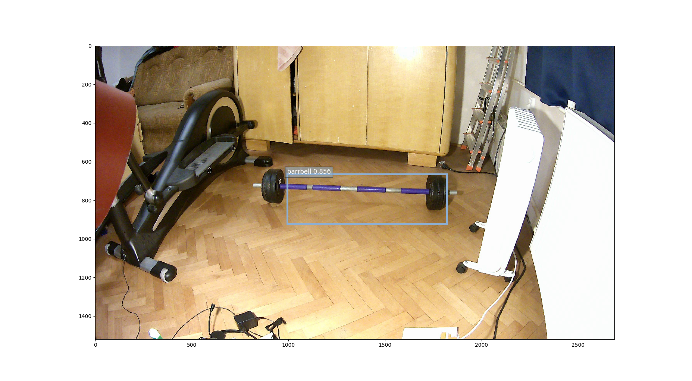

I have mxnet ssd Resnet50 model trained on custom dataset. For training, dataset preparation etc. I have used https://github.com/apache/incubator-mxnet/tree/master/example/ssd and training ran on `p2.xlarge` with `Deep Learning AMI (Ubuntu) Version 2.0 (ami-9ba7c4e1)` Intel's Deeplearning Deployment Toolkit is in version `2017.1.0.5852` (also have tried 56xx), running on EC2 instance and also on DeepLens camera.

I have deployed it:

```
$ python3 deploy.py --prefix model/ssd_resnet50_300 --network resnet50 --num-class 20
Saved model: model/deploy_ssd_resnet50_300-0000.params
Saved symbol: model/deploy_ssd_resnet50_300-symbol.json

```
and tested:

```
$ python3 demo.py --network resnet50 --prefix model/deploy_ssd_resnet50_300 --data-shape 224 --images ~/Documents/2018-02-06\ 15\:14\:10.951017.jpg --cpu --class-names barbell,2,3,4,5,6,7,8,9,10,11,12,13,14,15,16,17,18,19,20 --deploy
```
it worked



'barbell' is important, other classes are just dummy

## First issue
If I try to optimize it for Deeplens I get

```
$ python3 /opt/intel/deeplearning_deploymenttoolkit/deployment_tools/model_optimizer/mxnet_converter/mo_mxnet_converter.py --models-dir ./ --output-dir ./ --model-name deploy_ssd_resnet50_300 --img-width 224 --img-height 224 --img-channels 3 --precision FP16

/usr/local/lib/python3.5/dist-packages/mxnet/module/base_module.py:53: UserWarning: You created Module with Module(..., label_names=['softmax_label']) but input with name 'softmax_label' is not found in symbol.list_arguments(). Did you mean one of:
	data
  warnings.warn(msg)
Traceback (most recent call last):
  File "/opt/intel/deeplearning_deploymenttoolkit/deployment_tools/model_optimizer/mxnet_converter/mo_mxnet_converter.py", line 105, in <module>
    convert_model(args)
  File "/opt/intel/deeplearning_deploymenttoolkit/deployment_tools/model_optimizer/mxnet_converter/mo_mxnet_converter.py", line 82, in convert_model
    args.img_channels, enable_fuse, visualize_path)
  File "/opt/intel/deeplearning_deploymenttoolkit/deployment_tools/model_optimizer/mxnet_converter/mo_mxnet_converter.py", line 42, in get_model_config
    model = load_model(n_name, iteration_number, input_shape, data_path)
  File "/opt/intel/deeplearning_deploymenttoolkit/deployment_tools/model_optimizer/mxnet_converter/mo_mxnet_converter.py", line 31, in load_model
    return read_mxnet_json(json_path, input_shape, mx_loaded_model=model_loaded)
  File "/opt/intel/deeplearning_deploymenttoolkit_2017.1.0.5675/deployment_tools/model_optimizer/mxnet_converter/mxnet_convertor/mxnet_utils.py", line 26, in read_mxnet_json
    return MxNetModel(data, input_shape, mx_loaded_model)
  File "/opt/intel/deeplearning_deploymenttoolkit_2017.1.0.5675/deployment_tools/model_optimizer/mxnet_converter/mxnet_convertor/mxnet_primitives.py", line 59, in __init__
    json_layers = MxNetJsonModelPatternMatcher.insert_auxiliary_layers(json_layers)
  File "/opt/intel/deeplearning_deploymenttoolkit_2017.1.0.5675/deployment_tools/model_optimizer/mxnet_converter/mxnet_convertor/mxnet_pattern_matcher.py", line 26, in insert_auxiliary_layers
    MxNetJsonModelPatternMatcher.generic_pattern_split_bn(json_layers)
  File "/opt/intel/deeplearning_deploymenttoolkit_2017.1.0.5675/deployment_tools/model_optimizer/mxnet_converter/mxnet_convertor/mxnet_pattern_matcher.py", line 46, in generic_pattern_split_bn
    if 'fix_gamma' in l[attr]:
KeyError: 'param'

```

After while digging into convertor source codes. I have found
```Python
def get_json_layer_attrs(json_dic):
    is_new_mxnet = 'attr' in json_dic
    return json_dic['attr' if is_new_mxnet else 'param']
```
but in my `-symbol.json` file there are not `attr` nor `param` keys but `attrs`. So in deployed symbol I have replaced `attrs` with `param`, `attrs` has to remain just on almost last line: `"attrs": {"mxnet_version": ["int", 10000]}`. Then I was able to convert my model. I have tested my edited model with `demo.py` and it worked. I have also tried to download, deploy, edit ('attrs' => 'param') and convert https://github.com/zhreshold/mxnet-ssd/releases/download/v0.6/resnet50_ssd_512_voc0712_trainval.zip and it worked with `object_detection_sample_ssd` (from intels deployment toolkit) and also with camera. So I hope the change ('attrs' => 'param') is not breaking models.

Note: when converting downloaded trained `resnet50_ssd_512` I got info about Upgrading symbol:
```
$ python3 deploy.py --prefix test/ssd_resnet50_512 --network resnet50 --num-class 20
[15:39:02] src/nnvm/legacy_json_util.cc:209: Loading symbol saved by previous version v0.10.1. Attempting to upgrade...
[15:39:02] src/nnvm/legacy_json_util.cc:217: Symbol successfully upgraded!
Saved model: test/deploy_ssd_resnet50_512-0000.params
Saved symbol: test/deploy_ssd_resnet50_512-symbol.json
```


## Second Issue
So I was able to convert my model with some warning (maybe issue 1.5?):

```
$ python3 /opt/intel/deeplearning_deploymenttoolkit/deployment_tools/model_optimizer/mxnet_converter/mo_mxnet_converter.py --models-dir ./ --output-dir ./ --model-name deploy_ssd_resnet50_300 --img-width 224 --img-height 224 --img-channels 3 --precision FP16

/usr/local/lib/python3.5/dist-packages/mxnet/module/base_module.py:53: UserWarning: You created Module with Module(..., label_names=['softmax_label']) but input with name 'softmax_label' is not found in symbol.list_arguments(). Did you mean one of:
	data
  warnings.warn(msg)

```

If i try sample app `object_detection_sample_ssd` it worked on image taken from camera it ran without error but was not able to detect anything (highest prob = 0.283691) :/

```
$ /home/aws_cam/build/intel64/Release/object_detection_sample_ssd -i /home/aws_cam/Documents/2018-02-06\ 15\:14\:10.951017.jpg -m ./mxnet_deploy_ssd_resnet50_300_FP16_FUSED.xml -d GPU 

InferenceEngine: 
	API version ............ 1.0
	Build .................. 5675
[ INFO ] Parsing input parameters
[ INFO ] No extensions provided
[ INFO ] Loading plugin

	API version ............ 0.1
	Build .................. ci-main-02529
	Description ....... clDNNPlugin

[ INFO ] Loading network files
[ INFO ] Preparing input blobs
[ INFO ] Batch size is 1
[ INFO ] Preparing output blobs
[ INFO ] Loading model to the plugin
[ INFO ] Start inference

Average running time of one iteration: 128.968 ms
[ INFO ] Processing output blobs
[0,1] element, prob = 0.283691    (86.6278,93.9737)-(229.118,227.572)
[1,1] element, prob = 0.103699    (-18.1295,38.4311)-(239.129,182.099)
[2,1] element, prob = 0.0603943    (69.1194,41.7883)-(174.248,131.458)
[3,1] element, prob = 0.0358887    (30.1571,68.4765)-(110.433,245.701)
[4,1] element, prob = 0.0189819    (165.478,145.856)-(227.823,250.162)
[5,1] element, prob = 0.0179596    (122.741,-0.333392)-(206.951,166.026)
[6,2] element, prob = 0.0395813    (37.4374,-17.7685)-(183.428,242.853)
[7,2] element, prob = 0.0303802    (150.945,155.429)-(236.386,235.999)
[8,2] element, prob = 0.0141754    (-5.87648,160.759)-(74.5978,239.074)
[9,2] element, prob = 0.0116119    (82.5519,108.805)-(243.328,203.691)
[10,3] element, prob = 0.0413208    (115.625,27.3434)-(204.68,240.009)
[11,3] element, prob = 0.0351562    (-8.88905,165.596)-(93.9406,228.298)
[12,3] element, prob = 0.0332336    (-18.1295,38.4311)-(239.129,182.099)
[13,3] element, prob = 0.0205536    (169.878,133.192)-(220.021,255.936)
[14,3] element, prob = 0.014595    (106.086,172.199)-(262.656,219.614)
[15,3] element, prob = 0.0142822    (21.8259,16.0486)-(88.9033,102.017)
[16,4] element, prob = 0.0453186    (30.6779,37.5496)-(200.569,195.657)
[17,4] element, prob = 0.0197296    (169.878,133.192)-(220.021,255.936)
[18,4] element, prob = 0.0156097    (110.212,14.0064)-(220.587,125.43)
[19,4] element, prob = 0.0154724    (25.2336,1.93257)-(99.0913,163.27)
[20,5] element, prob = 0.0370178    (30.6779,37.5496)-(200.569,195.657)
[21,5] element, prob = 0.023819    (139.36,153.047)-(245.438,242.95)
[22,5] element, prob = 0.0127258    (-1.1152,144.603)-(69.8433,252.32)
[23,5] element, prob = 0.0120316    (131.923,33.4828)-(240.103,135.889)
[24,6] element, prob = 0.036438    (10.9124,13.0254)-(205.631,207.03)
[25,6] element, prob = 0.0219574    (93.1723,106.884)-(224.393,221.75)
[26,7] element, prob = 0.0361938    (37.4374,-17.7685)-(183.428,242.853)
[27,7] element, prob = 0.0238037    (75.7847,78.0771)-(164.487,141.469)
[28,7] element, prob = 0.0222931    (70.8213,115.576)-(255.032,200.513)
[29,7] element, prob = 0.019989    (21.166,169.407)-(168.373,222.935)
[30,7] element, prob = 0.015976    (131.133,171.119)-(247.245,226.604)
[31,7] element, prob = 0.0125275    (77.4205,30.404)-(257.611,103.628)
[32,8] element, prob = 0.0519104    (150.945,155.429)-(236.386,235.999)
[33,8] element, prob = 0.0464478    (3.39868,8.05769)-(210.561,211.576)
[34,8] element, prob = 0.0373535    (26.9769,167.778)-(152.935,228.189)
[35,8] element, prob = 0.0345459    (93.1723,106.884)-(224.393,221.75)
[36,9] element, prob = 0.0577393    (3.39868,8.05769)-(210.561,211.576)
[37,9] element, prob = 0.0263367    (93.1723,106.884)-(224.393,221.75)
[38,9] element, prob = 0.0151901    (116.024,1.58614)-(213.387,142.113)
[39,9] element, prob = 0.0144882    (30.1571,68.4765)-(110.433,245.701)
[40,10] element, prob = 0.0508423    (-18.1295,38.4311)-(239.129,182.099)
[41,10] element, prob = 0.0205231    (93.1723,106.884)-(224.393,221.75)
[42,10] element, prob = 0.0139999    (110.212,14.0064)-(220.587,125.43)
[43,10] element, prob = 0.0119324    (169.878,133.192)-(220.021,255.936)
[44,10] element, prob = 0.0101929    (131.133,171.119)-(247.245,226.604)
[45,11] element, prob = 0.0383911    (30.6779,37.5496)-(200.569,195.657)
[46,11] element, prob = 0.0159912    (165.478,145.856)-(227.823,250.162)
[47,11] element, prob = 0.0140915    (93.1723,106.884)-(224.393,221.75)
[48,12] element, prob = 0.0551758    (3.39868,8.05769)-(210.561,211.576)
[49,12] element, prob = 0.0295868    (93.1723,106.884)-(224.393,221.75)
[50,12] element, prob = 0.022583    (30.1571,68.4765)-(110.433,245.701)
[51,12] element, prob = 0.0190277    (165.478,145.856)-(227.823,250.162)
[52,13] element, prob = 0.0384521    (10.9124,13.0254)-(205.631,207.03)
[53,13] element, prob = 0.0327454    (70.8213,115.576)-(255.032,200.513)
[54,13] element, prob = 0.0123138    (106.086,172.199)-(262.656,219.614)
[55,14] element, prob = 0.0622253    (57.7027,21.1328)-(173.451,227.483)
[56,14] element, prob = 0.0157166    (169.878,133.192)-(220.021,255.936)
[57,14] element, prob = 0.0143127    (122.741,-0.333392)-(206.951,166.026)
[58,14] element, prob = 0.013298    (82.5519,108.805)-(243.328,203.691)
[59,14] element, prob = 0.0105209    (106.086,172.199)-(262.656,219.614)
[60,15] element, prob = 0.0368347    (30.6779,37.5496)-(200.569,195.657)
[61,15] element, prob = 0.0222931    (131.133,171.119)-(247.245,226.604)
[62,15] element, prob = 0.0102463    (169.878,133.192)-(220.021,255.936)
[63,16] element, prob = 0.0455933    (3.39868,8.05769)-(210.561,211.576)
[64,16] element, prob = 0.0377197    (150.945,155.429)-(236.386,235.999)
[65,16] element, prob = 0.0366516    (93.1723,106.884)-(224.393,221.75)
[66,16] element, prob = 0.0247498    (26.9769,167.778)-(152.935,228.189)
[67,16] element, prob = 0.0137558    (72.0289,50.3619)-(194.847,120.188)
[68,16] element, prob = 0.0120544    (-5.87648,160.759)-(74.5978,239.074)
[69,17] element, prob = 0.051239    (10.9124,13.0254)-(205.631,207.03)
[70,17] element, prob = 0.0213776    (93.1723,106.884)-(224.393,221.75)
[71,17] element, prob = 0.0142746    (110.212,14.0064)-(220.587,125.43)
[72,17] element, prob = 0.0111847    (150.945,155.429)-(236.386,235.999)
[73,18] element, prob = 0.0561218    (30.6779,37.5496)-(200.569,195.657)
[74,18] element, prob = 0.0157928    (93.1723,106.884)-(224.393,221.75)
[75,18] element, prob = 0.0147858    (110.212,14.0064)-(220.587,125.43)
[76,18] element, prob = 0.0143585    (165.478,145.856)-(227.823,250.162)
[77,19] element, prob = 0.0392761    (37.4374,-17.7685)-(183.428,242.853)
[78,19] element, prob = 0.0195312    (82.5519,108.805)-(243.328,203.691)
[79,19] element, prob = 0.0179749    (106.086,172.199)-(262.656,219.614)
[80,19] element, prob = 0.0147018    (169.878,133.192)-(220.021,255.936)
[81,20] element, prob = 0.0495911    (12.9997,57.5501)-(221.069,176.684)
[82,20] element, prob = 0.0294647    (70.8213,115.576)-(255.032,200.513)
[83,20] element, prob = 0.0124588    (131.133,171.119)-(247.245,226.604)
Only 84 proposals found
[ INFO ] Image out.bmp created!
[ INFO ] Execution successfull
```


If I try `demo.py` on resized image, it worked fine:
```
$ python3 demo.py --network resnet50 --prefix model/deploy_ssd_resnet50_300 --data-shape 224 --images ~/Pictures/out.bmp --cpu --class-names barbell,2,3,4,5,6,7,8,9,10,11,12,13,14,15,16,17,18,19,20 --deploy
Detection time for 1 images: 1.0584 sec

```


So What is breaking my model?

I have also uploaded zipped trained model, deployed (edited `attrs` => `param`) and converted model to https://s3.amazonaws.com/deeplens-th-ex/model.zip
